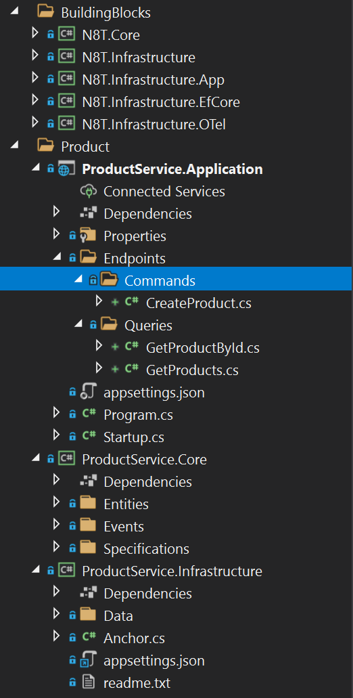

# practical-clean-ddd

The practical repository uses coolstore domain which is mainly borrowed from `https://github.com/zkavtaskin/Domain-Driven-Design-Example` to demonstrate how to apply Domain Driven Design seamlessly with Clean Architecture.

[](https://stars.medv.io/thangchung/practical-clean-ddd)

## Give a star ⭐

If you're using this repository for your samples, workshop, your project or whatever, please give a star ⭐. Thank you very much :+1:

> Plz, use this project with care because we're using this repository for brainstorming new ideas in .NET and containerization worlds! 

# Give it a try!

- Prerequisite
  - .NET SDK: 5.0.200-preview.21079.7
  - Rust: v1.50.0
  - nodejs: v15.5.1
  - tye: 0.7.0-alpha.21070.7+eb3b50699b7a5f2d0997a5cc8c5185d056dde8ec
  - dapr: 1.0.0

- Starting the Api

```
$ tye run
```

- Starting the web application

```
$ cd src\Web
$ npm i
$ npm run dev
```

- Public Apis:

> Tye Dashboard: [http://localhost:8000](http://localhost:8000)
> 
> Play around at [restclient.http](restclient.http)

<table>
  <thead>
    <th>No.</th>
    <th>Service name</th>
    <th>Service uri</th>
  </thead>
  <tbody>
    <tr>
      <td>1</td>
      <td>gateway</td>
      <td><a href="http://localhost:5000">http://localhost:5000</a></td>
    </tr>
    <tr>
      <td>2</td>
      <td>product (internal)</td>
      <td><a href="http://localhost:5002">http://localhost:5002</a></td>
    </tr>
    <tr>
      <td>3</td>
      <td>customer (internal)</td>
      <td><a href="http://localhost:5003">http://localhost:5003</a></td>
    </tr>
    <tr>
      <td>4</td>
      <td>setting (internal)</td>
      <td><a href="http://localhost:5005">http://localhost:5005</a></td>
    </tr>
    <tr>
      <td>5</td>
      <td>audit (internal)</td>
      <td><a href="http://localhost:5010">http://localhost:5010</a></td>
    </tr>
    <tr>
      <td>6</td>
      <td>frontend</td>
      <td><a href="http://localhost:3000">http://localhost:3000</a></td>
    </tr>
  </tbody>
</table>

# Business Usecases


# High level context


# ERD


# Clean Domain Driven-design

Domain-driven Design demonstrates it can help the business tidy and organized in many years. But it is hard to approach and use, we need to make it easier to use in the real project when we get started. 

Clean Architecture helps the project structure easier to refactor and evolve in medium and big projects. Especially in the Microservice world, we always want to do and try with a lot of time in the project lifetime.

Clean Domain-driven Design is a collection of basic building blocks and project structure to help we get starting the project with less code boilerplate and effortless. We focus on the Microservice approach of how can we organize code, the project with the monorepo approach, and you can use it for modular monolith project as well.



## Core project
### Domain

TODO

### Repository

TODO

## Infrastructure project

TODO

## Application project

TODO

# Public CRUD interface

In medium and large software projects, we normally implement the CRUD actions over and over again. And it might take around 40-50% codebase just to do CRUD in the projects. The question is can we make standardized CRUD APIs, then we can use them in potential projects in the future? That is in my mind for a long time when I started and finished many projects, and I decide to take time to research and define the public interfaces for it as below

## Common

```csharp
public record ResultModel<T>(T Data, bool IsError = false, string? ErrorMessage = default);
```

```csharp
public interface ICommand<T> : IRequest<ResultModel<T>> {}
```

```csharp
public interface IQuery<T> : IRequest<ResultModel<T>> {}
```

## [R]etrieve

```csharp
// input model for list query (normally using for the table UI control with paging, filtering and sorting)
public interface IListQuery<TResponse> : IQuery<TResponse>
{
  public List<string> Includes { get; init; }
  public List<FilterModel> Filters { get; init; }
  public List<string> Sorts { get; init; }
  public int Page { get; init; }
  public int PageSize { get; init; }
}
```

```csharp
// output model with items, total items, page and page size with serving for binding with the table UI control
public record ListResponseModel<T>(List<T> Items, long TotalItems, int Page, int PageSize);
```

```csharp
public interface IItemQuery<TId, TResponse> : IQuery<TResponse>
{
  public List<string> Includes { get; init; }
  public TId Id { get; init; }
}
```

## [C]reate

```csharp
public interface ICreateCommand<TRequest, TResponse> : ICommand<TResponse>, ITxRequest
{
    public TRequest Model { get; init; }
}
```

## [U]pdate

```csharp
public interface IUpdateCommand<TRequest, TResponse> : ICommand<TResponse>, ITxRequest
{
  public TRequest Model { get; init; }
}
```

## [D]elete

```csharp
public interface IDeleteCommand<TId, TResponse> : ICommand<TResponse> where TId : struct
{
  public TId Id { get; init; }
}
```

# Service Invocation

- RestEase with Dapr handler. More information is at https://dev.to/thangchung/how-to-make-dapr-client-works-well-with-refit-and-restease-40m

# Event Bus

```csharp
public interface IEventBus
{
  Task PublishAsync<TEvent>(TEvent @event, string[] topics = default, CancellationToken token = default) where TEvent : IDomainEvent;

  Task SubscribeAsync<TEvent>(string[] topics = default, CancellationToken token = default) where TEvent : IDomainEvent;
}
```

- Dapr provider

# Transactional Outbox

```csharp
public class OutboxEntity
{
    [JsonInclude]
    public Guid Id { get; private set; }

    [JsonInclude]
    public DateTime OccurredOn { get; private set; }

    [JsonInclude]
    public string Type { get; private set; }

    [JsonInclude]
    public string Data { get; private set; }

    public OutboxEntity()
    {
        // only for System.Text.Json to deserialized data
    }

    public OutboxEntity(Guid id, DateTime occurredOn, IDomainEvent @event)
    {
        Id = id.Equals(Guid.Empty) ? Guid.NewGuid() : id;
        OccurredOn = occurredOn;
        Type = @event.GetType().FullName;
        Data = JsonConvert.SerializeObject(@event);
    }

    public virtual IDomainEvent RecreateMessage(Assembly assembly) => (IDomainEvent)JsonConvert.DeserializeObject(Data, assembly.GetType(Type)!);
}
```

- Dapr provider

# Private `nuget` for NetCoreKit

Fork this repository!

Set global nuget for accessing in Visual Studio

```
# edit C:\Users\<current user>\AppData\Roaming\NuGet\NuGet.Config

```

```xml
<?xml version="1.0" encoding="utf-8"?>
<configuration>
  <packageSources>
    <add key="nuget.org" value="https://api.nuget.org/v3/index.json" protocolVersion="3" />
    <add key="github" value="https://nuget.pkg.github.com/thangchung/index.json" />
  </packageSources>
  <packageSourceCredentials>
    <github>
      <add key="Username" value="<your github username>" />
      <add key="ClearTextPassword" value="<Github Token>" />
    </github>
  </packageSourceCredentials>
</configuration>
```

# Sample pages


# Refs
- [Ant Design Components](https://ant.design/components/overview)
- [C4 PlaintUML Model](https://github.com/plantuml-stdlib/C4-PlantUML/blob/master/samples/C4CoreDiagrams.md)
- [Real world PlantUML](https://real-world-plantuml.com)