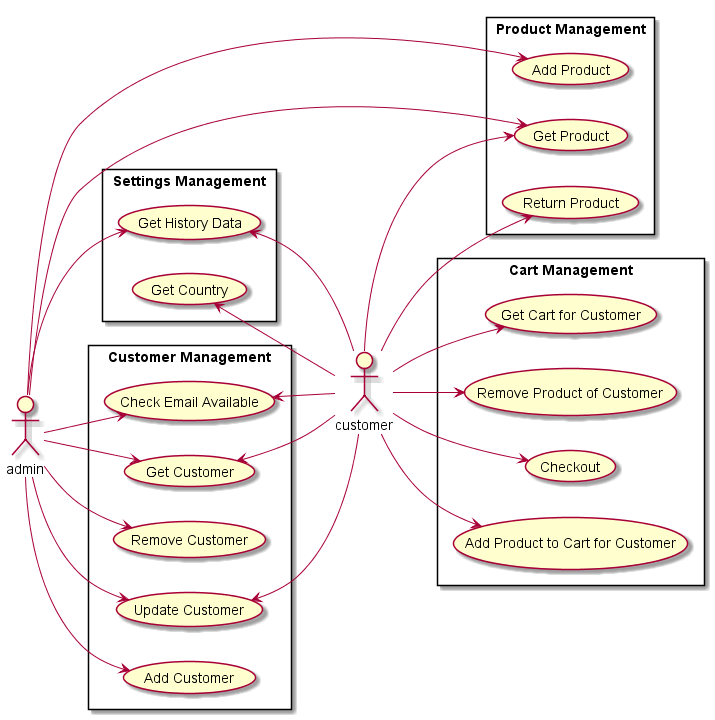
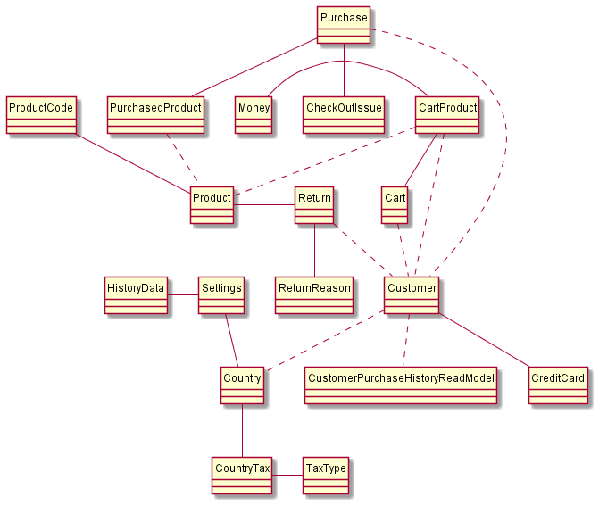
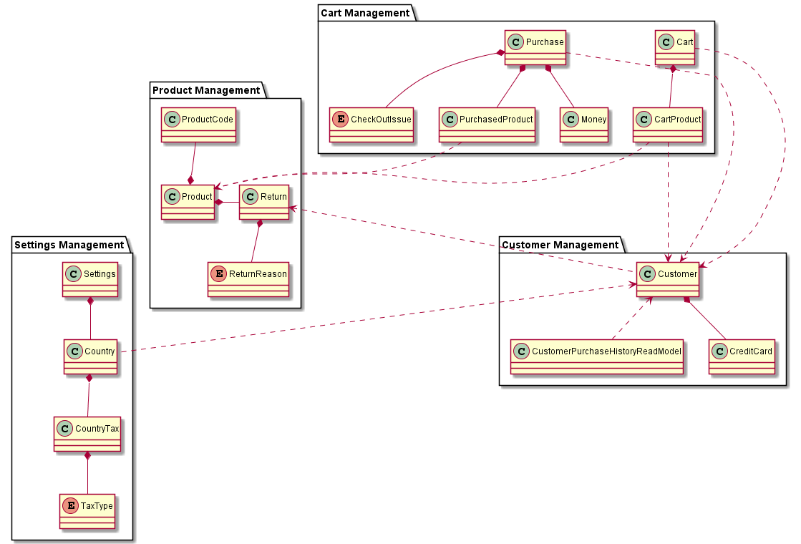
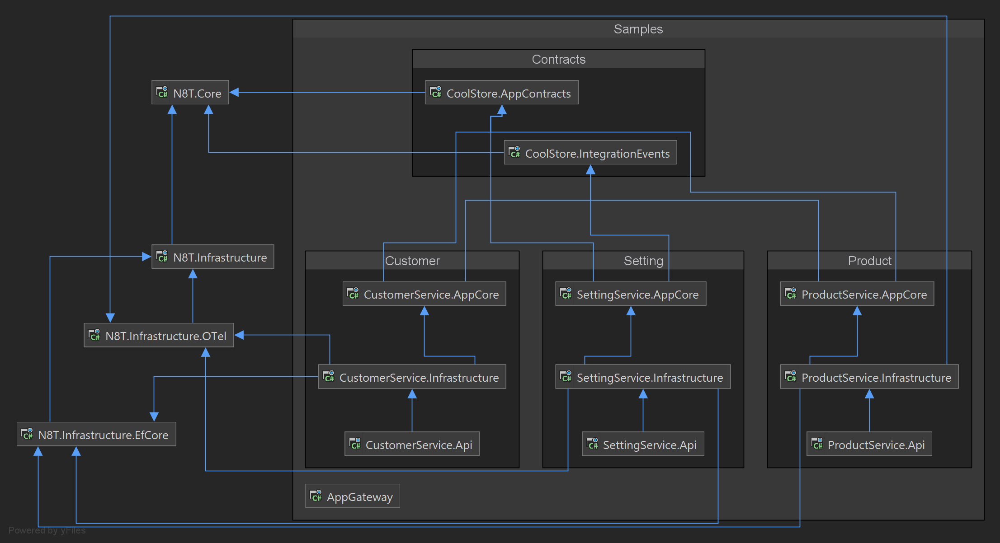
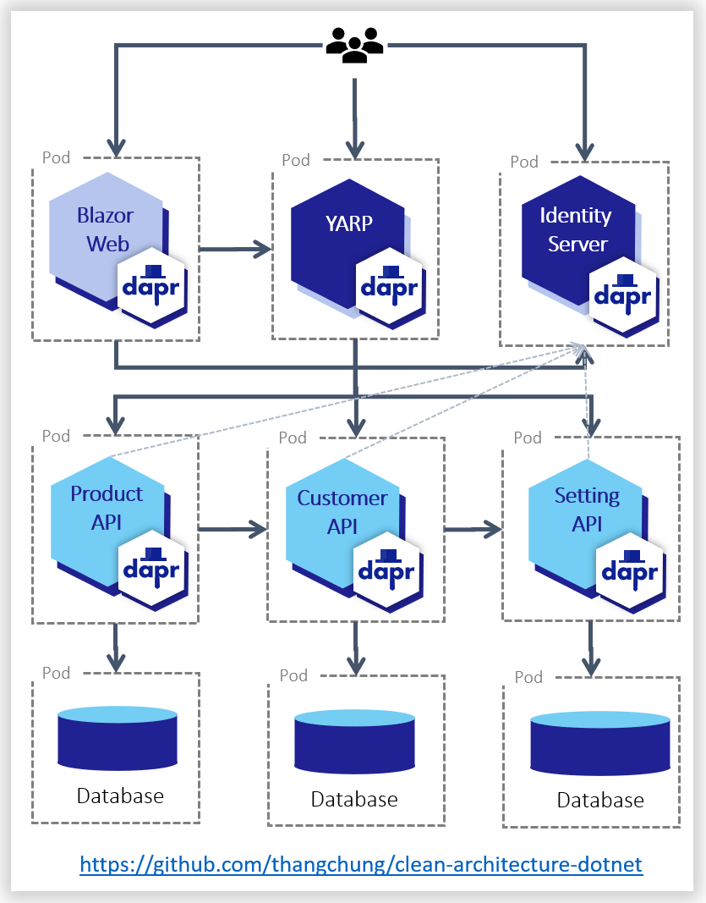
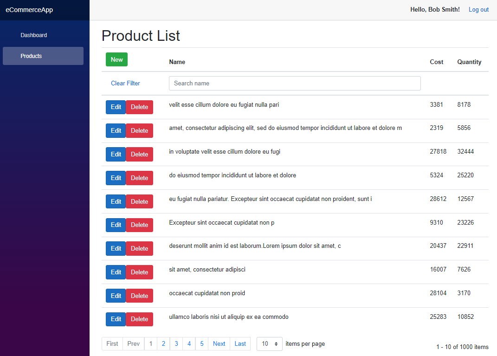

# 🔆 clean-architecture-dotnet

"Everything should be made as simple as possible, but not simpler." - Albert Einstein

"Mọi thứ đều nên đơn giản, càng đơn giản càng tốt, nhưng không nên đơn giản hơn bản chất của nó." - Vietnamese translated

We know that, and that's a reason we publish these libraries and samples. These are distillations with all best practices, tips, and tricks, and whatever made us spend a lot of time struggling to solve.

In the end of our journey, we would like to give these simplified and effortless libraries and samples as a reward for you. Enjoy the Minimal Clean Architecture, Domain-driven Design Lite, CQRS Lite, and just enough Cloud-native patterns!

[](https://stars.medv.io/thangchung/clean-architecture-dotnet)

> ### DISCLAIMER
> 
> **IMPORTANT:** Because we are constantly evolving towards newly released technologies, .NET 6 is in the preview state so that it might change a lot in every release by the .NET team. So even we're trying to do the best for this OSS. But be careful if you use it for your project, and make sure that you do a stress test, benchmarking these libraries, and refactor them subsequently to adapt to your business carefully.
> 
> **Feedback** with improvements and pull requests from the community will be highly appreciated. Thank you!

# ⭐ Give a star

If you're using this repository for your learning, samples, workshop, or your project, please give a star. Thanks :+1:

# 🎇 Business Usecases



# 🎇 High level context



# 🎇 ERD



# 🎇 Minimal DDD, CQRS, and Clean Architecture

1. `Domain-driven Design` (a.k.a DDD) demonstrates it can help the business tidy and organized in many years. But it is hard to approach and use, we need to make it easier to use in real projects when we get started.

2. `Command and Query Responsibility Segregation` (a.k.a CQRS) helps to separate components into command and query parts, but again it's really hard and might bloat when we get starting some of the project. We need something more lightweight, just like https://github.com/gautema/CQRSlite, but we might not need Event Sourcing in almost all projects.

3. `Clean Architecture` helps the project structure easier to refactor and evolve in medium and big projects. Especially in the Microservice world, we always want to do and try with a lot of time in the project lifetime. The thing is boilerplate code in this kind of project to make components lose coupling.

=> When we jump in and set up the project for the Microservice approach. We want to apply all the best practices from the community, and some kind of patterns and architecture above sometimes makes us feel power off when start implements the first line of code which actually solves the business requirements. So the solution is we need something minimal and enough to get starting, and then when our business gets grows by the time, then we go back to add more. That's what's the practical way to go!

`clean-architecture-dotnet` is a collection of basic building blocks and project structure to help we get starting the project with less code boilerplate and effortless. We focus on the Microservice approach of how can we organize code, the project with the monorepo approach, and you can use it for modular monolith projects as well.


Reference to https://github.com/Sairyss/domain-driven-hexagon

# 💎 Prerequisites

- [.NET SDK](https://dotnet.microsoft.com/download/dotnet/6.0): 6.0.100-preview.5.21271.2
- [nodejs](https://nodejs.org/en/download): v15.5.1
- [tye](https://github.com/dotnet/tye): 0.8.0-alpha.21301.1+0fed0b38e730cd07caf0a90287090638c110b77d
  - [Tan Hoang](https://github.com/cuno92) and [Mohammad AlQuraian](https://github.com/Quraian) have confused about `tye 0.8.0`, and asked to add the guidance so I put it here
    - Follow the guidance at https://github.com/dotnet/tye/blob/647a608892/docs/getting_started.md#working-with-ci-builds
    - More specifically, adding `dotnet tool install -g Microsoft.Tye --version "0.8.0-*" --add-source https://pkgs.dev.azure.com/dnceng/public/_packaging/dotnet5/nuget/v3/index.json` to your terminal
- [dapr](https://dapr.io/): 1.2.0
- Dev tools:
  - [vscode tye](https://marketplace.visualstudio.com/items?itemName=ms-azuretools.vscode-tye) extension
  - [vscode REST Client](https://marketplace.visualstudio.com/items?itemName=humao.rest-client) extension
  - [vscode Markmap](https://marketplace.visualstudio.com/items?itemName=gera2ld.markmap-vscode) extension

# :hearts: Technical stacks
- ✔️ **[`.NET Core 6`](https://dotnet.microsoft.com/download)** - .NET Framework and .NET Core, including ASP.NET and ASP.NET Core
- ✔️ **[`MVC Versioning API`](https://github.com/microsoft/aspnet-api-versioning)** - Set of libraries which add service API versioning to ASP.NET Web API, OData with ASP.NET Web API, and ASP.NET Core
- ✔️ **[`YARP`](https://github.com/microsoft/reverse-proxy)** - A toolkit for developing high-performance HTTP reverse proxy applications
- ✔️ **[`MediatR`](https://github.com/jbogard/MediatR)** - Simple, unambitious mediator implementation in .NET
- ✔️ **[`EF Core`](https://github.com/dotnet/efcore)** - Modern object-database mapper for .NET. It supports LINQ queries, change tracking, updates, and schema migrations
- ✔️ **[`FluentValidation`](https://github.com/FluentValidation/FluentValidation)** - Popular .NET validation library for building strongly-typed validation rules
- ✔️ **[`Swagger & Swagger UI`](https://github.com/domaindrivendev/Swashbuckle.AspNetCore)** - Swagger tools for documenting API's built on ASP.NET Core
- ✔️ **[`serilog`](https://github.com/serilog/serilog)** - Simple .NET logging with fully-structured events
- ✔️ **[`Dapr dotnet-sdk`](https://github.com/dapr/dotnet-sdk)** - Dapr SDK for .NET
- ✔️ **[`RestEase`](https://github.com/canton7/RestEase)** - Easy-to-use typesafe REST API client library for .NET Standard 1.1 and .NET Framework 4.5 and higher, which is simple and customisable
- ✔️ **[`Polly`](https://github.com/App-vNext/Polly)** - Polly is a .NET resilience and transient-fault-handling library that allows developers to express policies such as Retry, Circuit Breaker, Timeout, Bulkhead Isolation, and Fallback in a fluent and thread-safe manner
- ✔️ **[`Scrutor`](https://github.com/khellang/Scrutor)** - Assembly scanning and decoration extensions for Microsoft.Extensions.DependencyInjection
- ✔️ **[`opentelemetry-dotnet`](https://github.com/open-telemetry/opentelemetry-dotnet)** - The OpenTelemetry .NET Client
- ✔️ **[`Blazor - WASM`](https://dotnet.microsoft.com/apps/aspnet/web-apps/blazor)** - Client web apps with C#
- ✔️ **[`BFF`](https://github.com/DuendeSoftware/BFF)** - Framework for ASP.NET Core to secure SPAs using the Backend-for-Frontend (BFF) pattern

# 🎇 All packages dependencies



## ✔️ Building blocks


```bash
+---N8T.Core
|   |   N8T.Core.csproj
|   |
|   +---Domain
|   |       Cqrs.cs
|   |       Entities.cs
|   |       Events.cs
|   |       Exceptions.cs
|   |
|   +---Helpers
|   |       DateTimeHelper.cs
|   |       GuidHelper.cs
|   |
|   +---Repository
|   |       IRepository.cs
|   |
|   \---Specification
|           And.cs
|           Extensions.cs
|           GridSpecificationBase.cs
|           ISpecification.cs
|           Negated.cs
|           Or.cs
|           PredicateBuilder.cs
|           SpecificationBase.cs
|
+---N8T.Infrastructure
|   |   AppOptions.cs
|   |   Extensions.cs
|   |   N8T.Infrastructure.csproj
|   |
|   +---Auth
|   |       AuthBehavior.cs
|   |       Extensions.cs
|   |       IAuthRequest.cs
|   |       ISecurityContextAccessor.cs
|   |       SecurityContextAccessor.cs
|   |
|   +---Bus
|   |   |   Extensions.cs
|   |   |   IEventBus.cs
|   |   |
|   |   \---Dapr
|   |       |   DaprEventBusOptions.cs
|   |       |
|   |       \---Internal
|   |               DaprEventBus.cs
|   |
|   +---Controller
|   |       BaseController.cs
|   |
|   +---Helpers
|   |       ConfigurationHelper.cs
|   |
|   +---Logging
|   |       Extensions.cs
|   |       LoggingBehavior.cs
|   |       TraceIdEnricher.cs
|   |
|   +---ServiceInvocation
|   |   \---Dapr
|   |           Extensions.cs
|   |
|   +---Status
|   |       Extensions.cs
|   |       StatusModel.cs
|   |
|   +---Swagger
|   |       ConfigureSwaggerOptions.cs
|   |       Extentions.cs
|   |       SwaggerDefaultValues.cs
|   |
|   +---TransactionalOutbox
|   |   |   Extensions.cs
|   |   |   OutboxEntity.cs
|   |   |
|   |   \---Dapr
|   |       |   DaprTransactionalOutboxOptions.cs
|   |       |   ITransactionalOutboxProcessor.cs
|   |       |
|   |       \---Internal
|   |               LocalDispatchedHandler.cs
|   |               TransactionalOutboxProcessor.cs
|   |
|   \---Validator
|           Extensions.cs
|           RequestValidationBehavior.cs
|           ValidationError.cs
|           ValidationException.cs
|           ValidationResultModel.cs
|
+---N8T.Infrastructure.EfCore
|   |   AppDbContextBase.cs
|   |   Consts.cs
|   |   DbContextDesignFactoryBase.cs
|   |   Extensions.cs
|   |   IDbFacadeResolver.cs
|   |   N8T.Infrastructure.EfCore.csproj
|   |   Repository.cs
|   |   TxBehavior.cs
|   |
|   \---Internal
|           DbContextMigratorHostedService.cs
|
\---N8T.Infrastructure.OTel
    |   Extensions.cs
    |   N8T.Infrastructure.OTel.csproj
    |
    \---MediatR
            OTelMediatROptions.cs
            OTelMediatRTracingBehavior.cs
```

## ✔️ Product service structure (microservice)


```bash
+---ProductService.Api
|   |   .dockerignore
|   |   appsettings.json
|   |   Dockerfile
|   |   ProductService.Api.csproj
|   |   Program.cs
|   |
|   +---Properties
|   |       launchSettings.json
|   |
|   \---V1
|           Anchor.cs
|           IntegrationEventHandler.cs
|           ProductController.cs
|           TransactionalOutboxProcessor.cs
|
+---ProductService.AppCore
|   |   Anchor.cs
|   |   ProductService.AppCore.csproj
|   |
|   +---Core
|   |   |   Product.cs
|   |   |   ProductCode.cs
|   |   |   Return.cs
|   |   |   ReturnReason.cs
|   |   |
|   |   \---Specs
|   |           ProductByIdQuerySpec.cs
|   |           ProductIsInStockSpec.cs
|   |           ProductListQuerySpec.cs
|   |           ProductReturnReasonSpec.cs
|   |
|   \---UseCases
|       +---Commands
|       |       CreateProduct.cs
|       |
|       \---Queries
|               GetProductById.cs
|               GetProducts.cs
|
\---ProductService.Infrastructure
    |   Anchor.cs
    |   Extensions.cs
    |   ProductService.Infrastructure.csproj
    |   readme.txt
    |
    \---Data
        |   MainDbContext.cs
        |   MainDbContextDesignFactory.cs
        |   Repository.cs
        |
        +---Migrations
        |       20210129103734_InitialProductionDb.cs
        |       20210129103734_InitialProductionDb.Designer.cs
        |       20210129104438_SeedInitData.cs
        |       20210129104438_SeedInitData.Designer.cs
        |       MainDbContextModelSnapshot.cs
        |
        \---Scripts
                20210129104438_SeedInitData.sql
```
# 🎇 Starting the APIs

```
$ cd samples
$ tye run
```

- Public Apis:

> Tye Dashboard: [http://localhost:8000](http://localhost:8000)
>
> Play around at [restclient.http](samples/restclient.http)

<table>
  <thead>
    <th>No.</th>
    <th>Service name</th>
    <th>Service uri</th>
  </thead>
  <tbody>
    <tr>
      <td>1</td>
      <td>YARP Gateway (downstream)</td>
      <td><a href="http://localhost:5000">http://localhost:5000</a></td>
    </tr>
    <tr>
      <td>2</td>
      <td>identity server</td>
      <td><a href="https://localhost:5001">https://localhost:5001</a></td>
    </tr>
    <tr>
      <td>3</td>
      <td>Web Blazor</td>
      <td><a href="https://localhost:5002">https://localhost:5002</a></td>
    </tr>
    <tr>
      <td>4</td>
      <td>product (upstream service)</td>
      <td><a href="http://localhost:5003">http://localhost:5003</a></td>
    </tr>
    <tr>
      <td>5</td>
      <td>customer (upstream service)</td>
      <td><a href="http://localhost:5004">http://localhost:5004</a></td>
    </tr>
    <tr>
      <td>6</td>
      <td>setting (upstream service)</td>
      <td><a href="http://localhost:5005">http://localhost:5005</a></td>
    </tr>
    <tr>
      <td colspan="3">
        
      </td>
    </tr>
  </tbody>
</table>

# 🎇 Additional parts
## Public CRUD interface

In medium and large software projects, we normally implement the CRUD actions over and over again. And it might take around 40-50% codebase just to do CRUD in the projects. The question is can we make standardized CRUD APIs, then we can use them in potential projects in the future? That is in my mind for a long time when I started and finished many projects, and I decide to take time to research and define the public interfaces for it as below

### ✔️ Common

```csharp
public record ResultModel<T>(T Data, bool IsError = false, string? ErrorMessage = default);
```

```csharp
public interface ICommand<T> : IRequest<ResultModel<T>> {}
```

```csharp
public interface IQuery<T> : IRequest<ResultModel<T>> {}
```

### ✔️ [R]etrieve

```csharp
// input model for list query (normally using for the table UI control with paging, filtering and sorting)
public interface IListQuery<TResponse> : IQuery<TResponse>
{
  public List<string> Includes { get; init; }
  public List<FilterModel> Filters { get; init; }
  public List<string> Sorts { get; init; }
  public int Page { get; init; }
  public int PageSize { get; init; }
}
```

```csharp
// output model with items, total items, page and page size with serving for binding with the table UI control
public record ListResponseModel<T>(List<T> Items, long TotalItems, int Page, int PageSize);
```

```csharp
public interface IItemQuery<TId, TResponse> : IQuery<TResponse>
{
  public List<string> Includes { get; init; }
  public TId Id { get; init; }
}
```

### ✔️ [C]reate

```csharp
public interface ICreateCommand<TRequest, TResponse> : ICommand<TResponse>, ITxRequest
{
    public TRequest Model { get; init; }
}
```

### ✔️ [U]pdate

```csharp
public interface IUpdateCommand<TRequest, TResponse> : ICommand<TResponse>, ITxRequest
{
  public TRequest Model { get; init; }
}
```

### ✔️ [D]elete

```csharp
public interface IDeleteCommand<TId, TResponse> : ICommand<TResponse> where TId : struct
{
  public TId Id { get; init; }
}
```

## Dapr components
### ✔️ Service Invocation

- RestEase with Dapr handler. More information is at https://dev.to/thangchung/how-to-make-dapr-client-works-well-with-refit-and-restease-40m

### ✔️ Event Bus

```csharp
public interface IEventBus
{
  Task PublishAsync<TEvent>(TEvent @event, string[] topics = default, CancellationToken token = default) where TEvent : IDomainEvent;

  Task SubscribeAsync<TEvent>(string[] topics = default, CancellationToken token = default) where TEvent : IDomainEvent;
}
```

- Dapr provider

### ✔️ Transactional Outbox

```csharp
public class OutboxEntity
{
    [JsonInclude]
    public Guid Id { get; private set; }

    [JsonInclude]
    public DateTime OccurredOn { get; private set; }

    [JsonInclude]
    public string Type { get; private set; }

    [JsonInclude]
    public string Data { get; private set; }

    public OutboxEntity()
    {
        // only for System.Text.Json to deserialized data
    }

    public OutboxEntity(Guid id, DateTime occurredOn, IDomainEvent @event)
    {
        Id = id.Equals(Guid.Empty) ? Guid.NewGuid() : id;
        OccurredOn = occurredOn;
        Type = @event.GetType().FullName;
        Data = JsonConvert.SerializeObject(@event);
    }

    public virtual IDomainEvent RecreateMessage(Assembly assembly) => (IDomainEvent)JsonConvert.DeserializeObject(Data, assembly.GetType(Type)!);
}
```

- Dapr provider

## Sample pages



# 🎇 Credits

- https://docs.microsoft.com/en-us/dotnet/architecture/modern-web-apps-azure/common-web-application-architectures
- https://github.com/zkavtaskin/Domain-Driven-Design-Example
- https://github.com/ardalis/CleanArchitecture
- https://github.com/CanerPatir/aspnet-core-clean-arch
- https://github.com/jasontaylordev/CleanArchitecture
- https://github.com/ThreeDotsLabs/wild-workouts-go-ddd-example
- https://github.com/alibaba/COLA
- [Ant Design Components](https://ant.design/components/overview)
- [C4 PlaintUML Model](https://github.com/plantuml-stdlib/C4-PlantUML/blob/master/samples/C4CoreDiagrams.md)
- [Real world PlantUML](https://real-world-plantuml.com)
