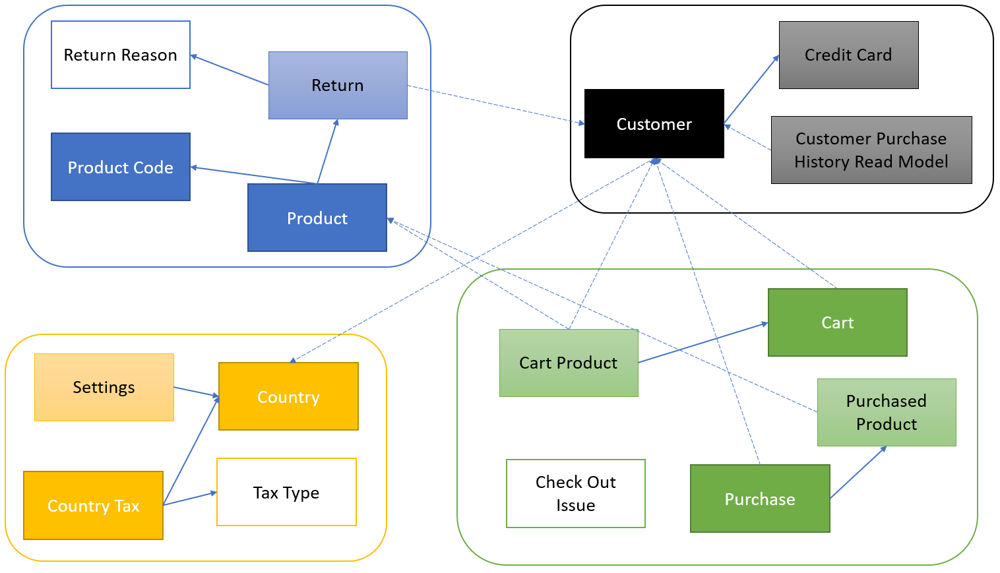

# practical-clean-ddd

The practical repository uses coolstore domain which mainly borrows from `https://github.com/zkavtaskin/Domain-Driven-Design-Example` to demonstrate how to apply Domain Driven Design seamlessly with Clean Architecture.

# High level ERD

