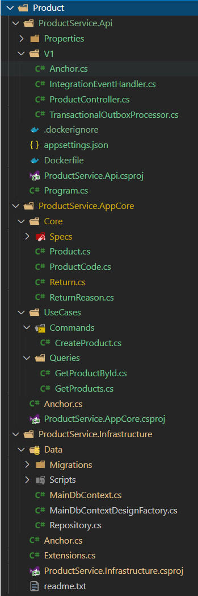

# 🔆 clean-architecture-dotnet

"Everything should be made as simple as possible, but not simpler." - Albert Einstein

"Mọi thứ đều nên đơn giản, càng đơn giản càng tốt, nhưng không nên đơn giản hơn bản chất của nó." - Vietnamese translated

We know that, and that's a reason we publish these libraries and samples. These are distillations with all best practices, tips, and tricks, and whatever made us spend a lot of time struggling to solve.

In the end of our journey, we would like to give these simplified and effortless libraries and samples as a reward for you. Enjoy the Minimal Clean Architecture, Domain-driven Design Lite, CQRS Lite, and just enough Cloud-native patterns!

[](https://stars.medv.io/thangchung/clean-architecture-dotnet)

> Even we're trying to do the best, but make sure you stress test carefully if you want to use these libs in the production environment.

# ⭐ Give a star

If you're using this repository for your learning, samples, workshop, or your project, please give a star ⭐. Thanks :+1:

# :hearts: Give it a try!

- Prerequisite
  - [.NET SDK](https://dotnet.microsoft.com/download/dotnet/6.0): 6.0.100-preview.5.21271.2
  - [nodejs](https://nodejs.org/en/download): v15.5.1
  - [tye](https://github.com/dotnet/tye): 0.8.0-alpha.21301.1+0fed0b38e730cd07caf0a90287090638c110b77d
  - [dapr](https://dapr.io/): 1.2.0
  - Dev tools:
    - [vscode tye](https://marketplace.visualstudio.com/items?itemName=ms-azuretools.vscode-tye) extension
    - [vscode REST Client](https://marketplace.visualstudio.com/items?itemName=humao.rest-client) extension

# 💎 Technical stacks
- ✔️ **[`.NET Core 6`](https://dotnet.microsoft.com/download)** - .NET Framework and .NET Core, including ASP.NET and ASP.NET Core
- ✔️ **[`MVC Versioning API`](https://github.com/microsoft/aspnet-api-versioning)** - Set of libraries which add service API versioning to ASP.NET Web API, OData with ASP.NET Web API, and ASP.NET Core
- ✔️ **[`YARP`](https://github.com/microsoft/reverse-proxy)** - A toolkit for developing high-performance HTTP reverse proxy applications
- ✔️ **[`MediatR`](https://github.com/jbogard/MediatR)** - Simple, unambitious mediator implementation in .NET
- ✔️ **[`EF Core`](https://github.com/dotnet/efcore)** - Modern object-database mapper for .NET. It supports LINQ queries, change tracking, updates, and schema migrations
- ✔️ **[`FluentValidation`](https://github.com/FluentValidation/FluentValidation)** - Popular .NET validation library for building strongly-typed validation rules
- ✔️ **[`Swagger & Swagger UI`](https://github.com/domaindrivendev/Swashbuckle.AspNetCore)** - Swagger tools for documenting API's built on ASP.NET Core
- ✔️ **[`serilog`](https://github.com/serilog/serilog)** - Simple .NET logging with fully-structured events
- ✔️ **[`Dapr dotnet-sdk`](https://github.com/dapr/dotnet-sdk)** - Dapr SDK for .NET
- ✔️ **[`RestEase`](https://github.com/canton7/RestEase)** - Easy-to-use typesafe REST API client library for .NET Standard 1.1 and .NET Framework 4.5 and higher, which is simple and customisable
- ✔️ **[`Polly`](https://github.com/App-vNext/Polly)** - Polly is a .NET resilience and transient-fault-handling library that allows developers to express policies such as Retry, Circuit Breaker, Timeout, Bulkhead Isolation, and Fallback in a fluent and thread-safe manner
- ✔️ **[`Scrutor`](https://github.com/khellang/Scrutor)** - Assembly scanning and decoration extensions for Microsoft.Extensions.DependencyInjection
- ✔️ **[`opentelemetry-dotnet`](https://github.com/open-telemetry/opentelemetry-dotnet)** - The OpenTelemetry .NET Client

## Starting the APIs

```
$ tye run
```

- Public Apis:

> Tye Dashboard: [http://localhost:8000](http://localhost:8000)
>
> Play around at [restclient.http](restclient.http)

<table>
  <thead>
    <th>No.</th>
    <th>Service name</th>
    <th>Service uri</th>
  </thead>
  <tbody>
    <tr>
      <td>1</td>
      <td>gateway</td>
      <td><a href="http://localhost:5000">http://localhost:5000</a></td>
    </tr>
    <tr>
      <td>2</td>
      <td>product (internal)</td>
      <td><a href="http://localhost:5002">http://localhost:5002</a></td>
    </tr>
    <tr>
      <td>3</td>
      <td>customer (internal)</td>
      <td><a href="http://localhost:5003">http://localhost:5003</a></td>
    </tr>
    <tr>
      <td>4</td>
      <td>setting (internal)</td>
      <td><a href="http://localhost:5005">http://localhost:5005</a></td>
    </tr>
    <tr>
      <td>5</td>
      <td>frontend (not updated)</td>
      <td><a href="http://localhost:3000">http://localhost:3000</a></td>
    </tr>
  </tbody>
</table>

# 🎇 Business Usecases


# 🎇 High level context


# 🎇 ERD


# 🎓 Clean Domain Driven-design

Domain-driven Design demonstrates it can help the business tidy and organized in many years. But it is hard to approach and use, we need to make it easier to use in the real project when we get started.

Clean Architecture helps the project structure easier to refactor and evolve in medium and big projects. Especially in the Microservice world, we always want to do and try with a lot of time in the project lifetime.

Clean Domain-driven Design is a collection of basic building blocks and project structure to help we get starting the project with less code boilerplate and effortless. We focus on the Microservice approach of how can we organize code, the project with the monorepo approach, and you can use it for modular monolith project as well.


Reference to https://github.com/Sairyss/domain-driven-hexagon

# Project structure



## Project dependencies


## Core project
### Domain

This contains all things to get start the project. Almost there are DDD-lite components just like Entity, AggregateRoot, Specification, Repository.

Assembly: N8T.Core.dll

## Infrastructure project

This is where some of component for Clean Architecture resides such as drivers (Entity Framework for PostgresDB, Authentication, Dapr Bus, MVC, Logging, Service Invocation with Dapr, Service Status model, Swagger with SwashBuckle, Transactional Outbox with Dapr, Tye configuration, Validation Model, OpenTelemetry components)

Assemblies: N8T.Infrastructure.dll, N8T.Infrastructure.EfCore.dll, N8T.Infrastructure.OTel.dll

# Additionals
## Public CRUD interface

In medium and large software projects, we normally implement the CRUD actions over and over again. And it might take around 40-50% codebase just to do CRUD in the projects. The question is can we make standardized CRUD APIs, then we can use them in potential projects in the future? That is in my mind for a long time when I started and finished many projects, and I decide to take time to research and define the public interfaces for it as below

### Common

```csharp
public record ResultModel<T>(T Data, bool IsError = false, string? ErrorMessage = default);
```

```csharp
public interface ICommand<T> : IRequest<ResultModel<T>> {}
```

```csharp
public interface IQuery<T> : IRequest<ResultModel<T>> {}
```

### [R]etrieve

```csharp
// input model for list query (normally using for the table UI control with paging, filtering and sorting)
public interface IListQuery<TResponse> : IQuery<TResponse>
{
  public List<string> Includes { get; init; }
  public List<FilterModel> Filters { get; init; }
  public List<string> Sorts { get; init; }
  public int Page { get; init; }
  public int PageSize { get; init; }
}
```

```csharp
// output model with items, total items, page and page size with serving for binding with the table UI control
public record ListResponseModel<T>(List<T> Items, long TotalItems, int Page, int PageSize);
```

```csharp
public interface IItemQuery<TId, TResponse> : IQuery<TResponse>
{
  public List<string> Includes { get; init; }
  public TId Id { get; init; }
}
```

### [C]reate

```csharp
public interface ICreateCommand<TRequest, TResponse> : ICommand<TResponse>, ITxRequest
{
    public TRequest Model { get; init; }
}
```

### [U]pdate

```csharp
public interface IUpdateCommand<TRequest, TResponse> : ICommand<TResponse>, ITxRequest
{
  public TRequest Model { get; init; }
}
```

### [D]elete

```csharp
public interface IDeleteCommand<TId, TResponse> : ICommand<TResponse> where TId : struct
{
  public TId Id { get; init; }
}
```

# Dapr components
## Service Invocation

- RestEase with Dapr handler. More information is at https://dev.to/thangchung/how-to-make-dapr-client-works-well-with-refit-and-restease-40m

## Event Bus

```csharp
public interface IEventBus
{
  Task PublishAsync<TEvent>(TEvent @event, string[] topics = default, CancellationToken token = default) where TEvent : IDomainEvent;

  Task SubscribeAsync<TEvent>(string[] topics = default, CancellationToken token = default) where TEvent : IDomainEvent;
}
```

- Dapr provider

## Transactional Outbox

```csharp
public class OutboxEntity
{
    [JsonInclude]
    public Guid Id { get; private set; }

    [JsonInclude]
    public DateTime OccurredOn { get; private set; }

    [JsonInclude]
    public string Type { get; private set; }

    [JsonInclude]
    public string Data { get; private set; }

    public OutboxEntity()
    {
        // only for System.Text.Json to deserialized data
    }

    public OutboxEntity(Guid id, DateTime occurredOn, IDomainEvent @event)
    {
        Id = id.Equals(Guid.Empty) ? Guid.NewGuid() : id;
        OccurredOn = occurredOn;
        Type = @event.GetType().FullName;
        Data = JsonConvert.SerializeObject(@event);
    }

    public virtual IDomainEvent RecreateMessage(Assembly assembly) => (IDomainEvent)JsonConvert.DeserializeObject(Data, assembly.GetType(Type)!);
}
```

- Dapr provider

# Sample pages

> We haven't have enough time to update the front-end API just yet :(


# Refs
- https://github.com/zkavtaskin/Domain-Driven-Design-Example
- [Ant Design Components](https://ant.design/components/overview)
- [C4 PlaintUML Model](https://github.com/plantuml-stdlib/C4-PlantUML/blob/master/samples/C4CoreDiagrams.md)
- [Real world PlantUML](https://real-world-plantuml.com)